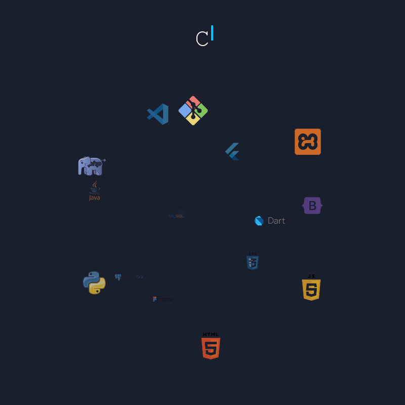

<!-- Banner -->

  

<!-- Character -->

  

<!-- Header Name with Typing Animation -->
#  Hi, I'm Chael!

 

<!-- Ma angas na Intro -->

I'm an aspiring developer exploring <b>full-stack development</b> and <b>UI/UX design</b>. 
I love building projects, improving my skills, and learning something new every day, because each day is an opportunity to grow, create, and explore. 
Currently based in the <b>Philippines</b>.

- ✨ Lifelong learner  
- 🌱 Improving my skills in **web & app development, and design**  
- 💻 Practicing **interactive UI design** with **Figma**  

---

<!-- Profile View -->

  

---

<!-- My Quote -->

  

    <table>
      <tr>
        <td>
          
        </td>
        <td>
          <em><b>"Life may be full of pain, but it also holds incredible beauty. Keep moving forward—your better days are on the way."</b></em> 
          — Chael Beltran
        </td>
        <td>
          
        </td>
      </tr>
    </table>
  

---

<!-- Tech Stack -->
<h2 align="center">Tech Stack</h2>

  <table>
    <tr>
      <td valign="top" width="50%">
        <table>
          <tr>
            <td align="center" width="200">
              <h4>Frontend</h4>
            </td>
            <td>
              
            </td>
          </tr>
          <tr>
            <td align="center" width="200">
              <h4>Backend</h4>
            </td>
            <td>
              
            </td>
          </tr>
          <tr>
            <td align="center" width="200">
              <h4>Mobile</h4>
            </td>
            <td>
              
            </td>
          </tr>
          <tr>
            <td align="center" width="200">
              <h4>Database</h4>
            </td>
            <td>
              
            </td>
          </tr>
          <tr>
            <td align="center" width="200">
              <h4>Tools & Others</h4>
            </td>
            <td>
              
              
            </td>
          </tr>
        </table>
      </td>
      <td valign="top" width="50%">
        
      </td>
    </tr>
  </table>

---

<!-- GitHub Streak -->
<h2 align="center">GitHub Streak</h2>

  

---

<!-- Connect With Me -->
<h2 align="center">Connect With Me</h2>

  
  
  
  

 

<!-- Footer -->

  

