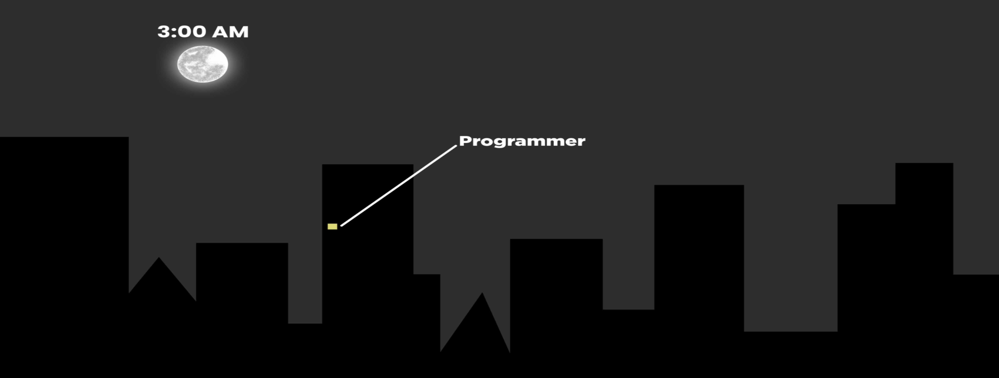

<!-- Banner -->

  

<!-- Character Image -->

  

<!-- Header Name with Typing Animation -->
#  Hi, I'm Chael!

 

<!-- Intro -->

I’m an aspiring developer exploring <b>full-stack development</b> and <b>UI/UX design</b>. 
I love building projects, improving my skills, and learning something new every day, because each day is an opportunity to grow, create, and explore. 
Currently based in the <b>Philippines</b>.

- ✨ Lifelong learner  
- 🌱 Improving my skills in **web & app development, and design**  
- 💻 Practicing **interactive UI design** with **Figma**  

---

<!-- Permanent Quote -->

  <em>"Life may be full of pain, but it also holds incredible beauty. Keep moving forward—your better days are on the way." - Chael Beltran</em>

---

<!-- Tech Stack -->
<h2 align="center">💻 Tech Stack</h2>

   
  
   
   
   
   
   
  
  
  
  
  
  
  
  

---

<!-- GitHub Streak -->
<h2 align="center">📊 GitHub Streak</h2>

  

---

<!-- Connect With Me -->
<h2 align="center">🤝 Connect With Me</h2>

  
  
  
  

 

<!-- Footer Wave -->

  

